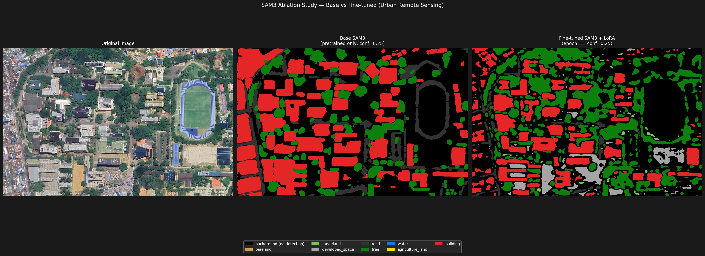

Fine-Tuning SAM3 for Remote Sensing Semantic Segmentation
Installation and Setup

This project implements the fine-tuning of the SAM3 model for semantic segmentation in remote sensing imagery.

Repository Setup

Clone the official repository:

git clone https://github.com/facebookresearch/sam3
cd sam3

Follow the installation instructions provided in the repository. The setup used in this project consists of:

**Create and activate the Conda environment:**
```bash
conda create -n sam3 python=3.12 -y
conda activate sam3
```

Install PyTorch according to your CUDA version and GPU specifications.
Install SAM3:
```bash
pip install -e . --no-build-isolation
```



## Architecture for fine tuning

### Incompatilibity between HuggingFace PEFT library and SAM

PEFT assumes transformer models that accept HuggingFace-style inputs such as `input_ids`, whereas SAM3 uses a completely different forward interface. To overcome this limitation, a custom LoRA implementation was developed that directly replaces selected linear layers while preserving the original SAM3 architecture.

```python
class LoRALinear(nn.Module):
    def __init__(self, original: nn.Linear, r: int, alpha: float, dropout: float = 0.0):
        super().__init__()
        self.original = original
        self.scale = alpha / r
        self.lora_A = nn.Linear(original.in_features, r, bias=False)
        self.lora_B = nn.Linear(r, original.out_features, bias=False)
        self.dropout = nn.Dropout(dropout)
        nn.init.kaiming_uniform_(self.lora_A.weight, a=math.sqrt(5))
        nn.init.zeros_(self.lora_B.weight)
        for p in self.original.parameters():
            p.requires_grad = False
        self.lora_A = self.lora_A.to(original.weight.device)
        self.lora_B = self.lora_B.to(original.weight.device)

    def forward(self, x):
        return self.original(x) + self.lora_B(self.lora_A(self.dropout(x))) * self.scale
```
 
### LoRA Target Selection

LoRA insertion exclusively to the attention output projection layers `´attn.proj`

```text
MODEL TYPE:
<class 'sam3.model.sam3_image.Sam3Image'>

LINEAR LAYERS:
├── backbone.vision_backbone.trunk.blocks [0-31]
│   ├── attn.qkv
│   ├── attn.proj
│   ├── mlp.fc1
│   └── mlp.fc2
└── backbone.language_backbone.encoder.transformer.resblocks [0-6]
    ├── attn.out_proj
    ├── mlp.c_fc
    └── mlp.c_proj
```

### Main Implementation Challenge 
Training exposed an additional limitation in SAM3's optimized inference kernels. A custom fused CUDA operation used by the model did not support gradient computation and therefore failed during backpropagation. This kernel was replaced with standard PyTorch operations (F.linear, F.relu, and F.gelu) to restore full autograd compatibility.


### Dataset
#### Training and Validation Set
The model was trained and validated using a publicly available remote sensing dataset obtained from Zenodo:

DOI: 10.5281/zenodo.7223446

The dataset contains pixel-level annotations for the following land-cover categories:

- Building
- Road
- Tree
- Water
- Bareland
- Rangeland
- Developed Space
- Agriculture Land
#### Test Set
SAS Planet enabled the acquisition of high-resolution imagery, optimized for local urban analysis.

The evaluation focused on urban areas in Bucaramanga, Santander, Colombia, with particular emphasis on the campus of the Universidad Industrial de Santander (UIS).

This local evaluation allows us to assess the generalization capability of the fine-tuned model on imagery collected outside the original training distribution.

## Results


### Ablations

### Training Performance

Training statistics were recorded throughout the optimization process and stored in:

`logs/my_experiment/logs/train_stats.json`

### Validation Performance

Validation metrics were collected after each evaluation cycle and stored in:

`logs/my_experiment/logs/val_stats.json`

### Best Model Performance

The best-performing checkpoint was selected according to the validation metrics and summarized in:

`logs/my_experiment/logs/best_stats.json`

The best model achieved the highest validation performance during training and was used for the final evaluation.


| Metric | Best Value | Source JSON Key |
| :--- | :---: | :--- |
| **mIoU (Semantic)** | 54.73% | `Losses/val_all_miou_semantic_seg` |
| **Dice Score** | 35.38% | `Losses/val_all_loss_semantic_dice` |
| **F1 Score** | 0.88 | `Losses/val_all_ce_f1` |
| **Validation Loss** | 32.2097 | `Losses/val_all_loss` |
| **Detection Accuracy** | 94.75% | `Losses/val_all_presence_dec_acc` |